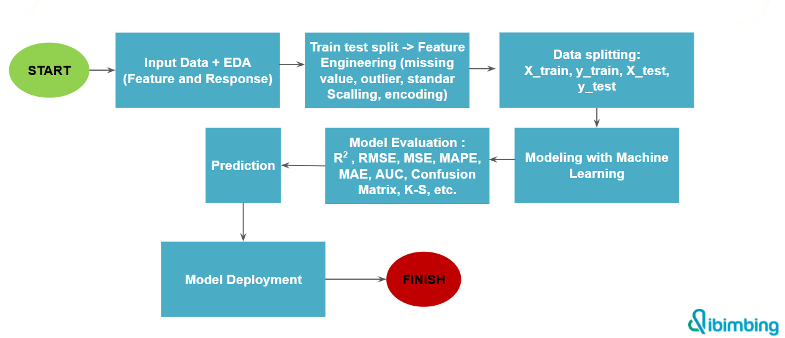

# Student Scores Prediction
This project aims to predict student scores based on the number of hours studied using machine learning techniques.
  

 
## Problem
Educators often face challenges in predicting students' test scores based solely on hours studied. Without the right model, predictions can be biased or less accurate, thereby affecting learning decisions and guidance strategies.

## Solution
Through modeling with Linear Regression and Decision Tree algorithms, this project seeks to provide more accurate predictive solutions. The model is trained using study hours and test score data, then evaluated to measure its performance and accuracy. 
$ Linear Regression: Provides a simple approach assuming a linear relationship between study hours and scores. 
$ Decision Tree: Able to capture more complex relationships and reduce bias, although you need to be aware of the potential for overfitting.

## Results
The prediction results show that both models are able to capture the pattern of the relationship between study hours and scores. The model with the best performance based on student hourly scores is Linear Regression
